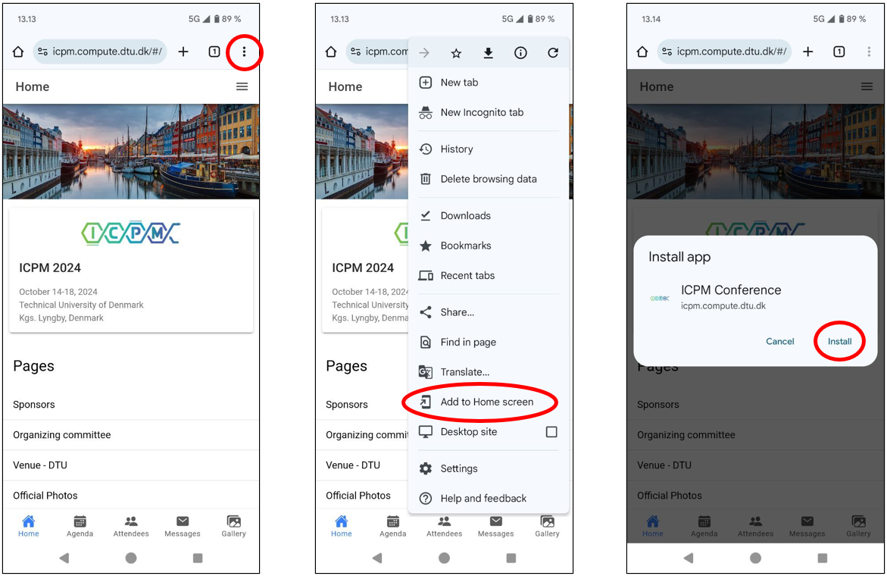
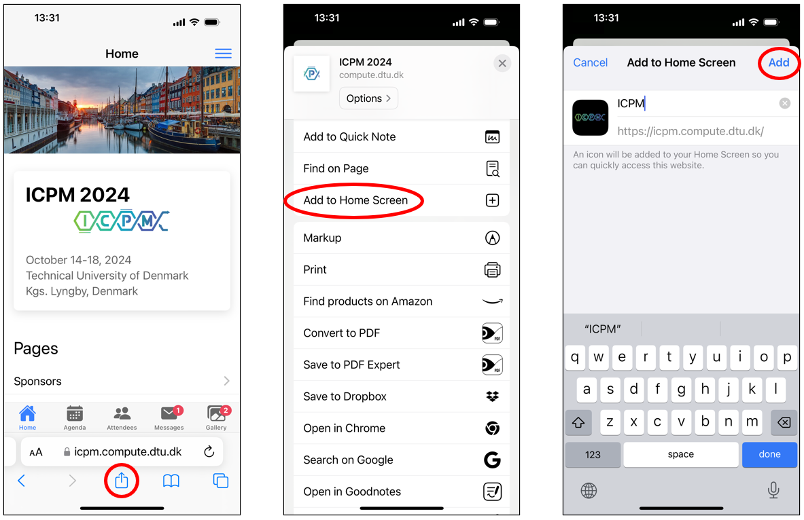

---
hide:
  - navigation
---

# Conferia

Conferia is an open app to help people during events. The current set of features includes:

* Login only for persons registered at the conference
* Personalized pages linked from the home
* Agenda with the possibility of "liking" events and build a personalized agenda
* List of attendees (including the details that each participant decides to share)
* Possibility to send messages to everyone
* Upload of pictures and possibility to "like" them

## Deployments

Conferia has been used at the following conferences:

* [BPM 2025](https://www.bpm2025seville.org/)
* [ICPM 2024](https://icpmconference.org/2024/)

## Installation instructions

Below you can find the instructions for installing the Conferia app on your mobile device.

### Installation instructions for Android

The default Chrome browser is capable of installing the Conferia App. First, navigate to the application URL of the conference using Chrome. Press the "three dots" icon in the upper right to open the menu. Select "Add to Home screen." Press the "Add" button in the popup. The Conferia App is now installed and available on your home screen.

### Installation instructions for iOS

The Conferia app can only be installed on iOS using the Safari browser. First, navigate to the application URL of the conference using Safari. Press the "Share" button, scroll the popup menu down and select "Add to Home Screen". Lastly, tap "Add" in the top right corner to finish the installation. It will now be on your home screen.

## Contact information

Conferia is a project developed at the Technical University of Denmark. For further information you can contact:

Andrea Burattin  
<https://andrea.burattin.net>  
<andbur@dtu.dk>
